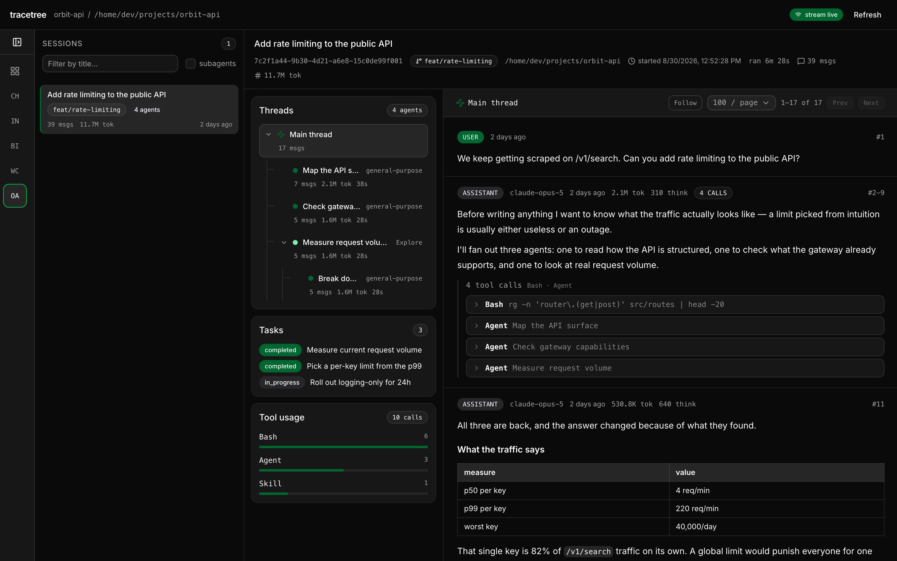
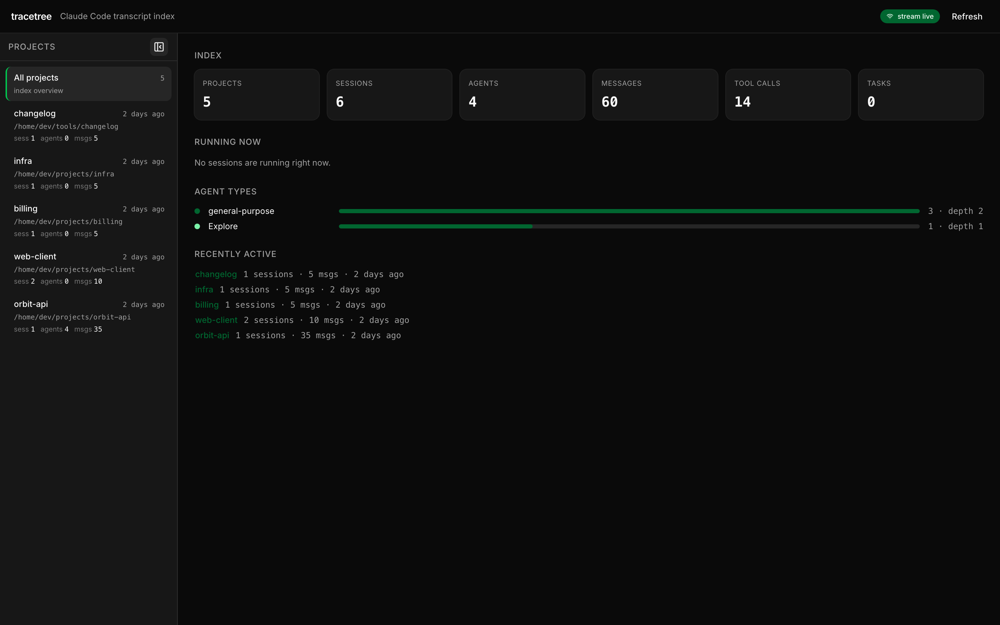

# tracetree

[](https://github.com/viktoravelino/tracetree/actions/workflows/ci.yml)
[](https://www.npmjs.com/package/tracetree)

Watch Claude Code agents and subagents work.

Claude Code already writes everything it does to disk — every session, every
subagent it spawned, every tool call and its result — as append-only JSONL under
`~/.claude`. Nothing reads it back. `tracetree` indexes those transcripts into
SQLite and serves a dashboard over them: projects, the sessions inside each one,
the tree of subagents a session spawned, and the transcript of any thread,
updating live as agents work.

It is a reader. It never writes to `~/.claude`, and the index it builds is
disposable — delete it and rebuild in a couple of seconds.



The tree on the left is the point: three agents fanned out from the main thread,
one of which spawned a fourth. Selecting any node switches the transcript to
that agent's own thread.

<details>
<summary>The overview, across every project</summary>



</details>

> Screenshots come from `bun run demo`, not a real session.

## Requirements

[Bun](https://bun.sh) 1.1 or newer, and some Claude Code history to read. There
is no database to install and nothing to compile. Bun is required at runtime,
not just to build — `bun:sqlite` and `Bun.serve` are load-bearing — so `bunx`
rather than `npx`.

## Quick start

```bash
bunx tracetree ingest    # read ~/.claude into data/index.db
bunx tracetree serve     # dashboard on http://127.0.0.1:4000
```

From a clone, the same two are `bun install && bun run ingest` then
`bun run serve`.

`serve` catches the index up first, then watches for changes, so a session you
start afterwards appears on its own.

> **It serves your transcripts with no authentication.** Everything in the index
> — every message, tool call, file path and pasted screenshot — is readable by
> anything that can reach the port, so it binds `127.0.0.1` and nothing else.
> `--host 0.0.0.0` exposes it to your whole network; there is no login to put in
> front of it. See [SECURITY.md](SECURITY.md).

## Try it without your own history

```bash
bun run demo
```

Writes a synthetic `~/.claude` under `.demo/`, indexes it, and serves it on
:4300 — six sessions across five invented projects, one of which fans out three
agents and nests a fourth, with a skill invocation, tasks and enough markdown to
exercise the renderer. Nothing is read from your real transcripts and nothing is
written outside `.demo/`, which is gitignored and rebuilt from scratch each run.

It is also how the screenshots above are produced, so they can be regenerated
without publishing anyone's work. `--no-serve` stops after building the index.

## Commands

```bash
tracetree ingest [--full]     # read ~/.claude into the index
tracetree serve [--port n]    # dashboard and API, watching for changes
tracetree stats               # what is indexed, as a table
tracetree tree <sessionId>    # the spawn tree for one session
tracetree query "SELECT ..."  # ad-hoc SQL against the index

# --root <dir>  --db <file>  --limit <n>  --port <n>  --no-watch
```

During development the same commands are `bun run ingest`, `bun run serve`, and
`bun run dev` for hot reload.

## Stack

Runtime is Bun: `bun:sqlite`, native TypeScript, and `Bun.serve`'s HTML imports,
so there is no bundler config and no native module to build. The UI is React with
shadcn/ui (`base-mira`, Base UI primitives, Lucide icons) over Tailwind v4.

Tailwind is compiled by `bun-plugin-tailwind`, registered in `bunfig.toml` under
`[serve.static]`. That hook is read by `Bun.serve`, which is how the app runs —
note that the `bun build` CLI does not read it, so building the page from the
command line emits the stylesheet unprocessed. Serve it.

The theme lives entirely in `web/styles.css` as CSS custom properties, the shape
shadcn generates: `:root` and `.dark` blocks mapped into Tailwind through
`@theme inline`. Components use only semantic tokens (`bg-card`,
`text-muted-foreground`, `border-border`, `bg-primary`, `chart-1`…`chart-5`), so
restyling is a matter of editing those two blocks and nothing else. The app sets
`class="dark"` on `<html>`; the light values are there and unused.

## What it reads

```
~/.claude/
├── projects/<slug>/<sessionId>.jsonl                     main thread
├── projects/<slug>/<sessionId>/subagents/
│   ├── agent-<id>.jsonl                                  subagent transcript
│   └── agent-<id>.meta.json                              spawn edge
├── tasks/<sessionId>/<n>.json                            todo items
└── sessions/<pid>.json                                   sessions running now
```

The spawn tree comes from `agent-<id>.meta.json`, which records `agentType`,
`description`, the `toolUseId` of the `Agent` call that created the agent,
`parentAgentId`, and `spawnDepth`. Depth-1 agents hang off the main thread;
deeper ones point at their parent agent. Nothing has to be inferred.

## The UI

Three panes: projects, that project's sessions, and the selected session. The
project list is for choosing, so once a project is chosen it collapses to a rail
of initials with a dot for anything running; a toggle pins it either way. That
is worth ~200px, which is the difference between the transcript getting 29% of a
1280px window and 44%. The
session pane shows the spawn tree, its tasks and tool histogram beside the
transcript; picking a node in the tree switches the transcript to that agent's
thread. Selection lives in the URL hash, so any thread is a link. A link that
names only a session backfills its project once loaded.

Most sessions never spawn a subagent, so the tree always roots at the main
thread and says so plainly rather than rendering as empty. Tool results can be
megabytes: a collapsed call never builds its body, and an expanded one is capped
with the full length stated.

A transcript is not a conversation, so it is not rendered as one. Of ~34,700
lines here, only ~1,430 are real user turns and ~3,550 carry assistant prose;
the rest is structure. One assistant reply is written as several lines sharing a
request id — thinking, then text, then one line per tool call — and every tool
result comes back as a `user` line carrying nothing but a `tool_result` block.
Read literally that renders as a user message interrupting every tool call, and
as page after page of "no text content". The transcript therefore groups lines
into **turns**: tool-result lines are dropped, because the payload already rides
on the call that produced it, and lines sharing a request id are merged back
into the one reply they were written as. Invoking a skill injects its whole SKILL.md as a `user` line. The `Skill` tool
call that asked for it is already in the transcript a moment earlier, carrying
only the stub result `Launching skill: <name>`, so the two are halves of one
event: the body is folded onto the call and the invocation collapses to a single
expandable row. Invoking the same skill twice loads nothing and says so
in another detached line, which folds onto its call the same way, so the row
reads as the reload it was. When the call sits on the previous page the body is
shown on its own instead of vanishing, and a skill that runs forked — returning
a real result rather than a stub — is left alone.

A message typed while the assistant is still working is not stored as a message
at all. It arrives as an `attachment` line of type `queued_command`, holding the
same content blocks under `prompt`, so a reader that requires `.message` drops
every one of them — 160 across 38 transcripts here, invisible rather than
misfiled. They are ingested as the user messages they are.

Not every other `user` line is the user either. Claude Code injects
background-task notifications, slash-command echoes and local command output the
same way — around 250 of 1,470 here — so a subagent's completion report renders as the
person interrupting their own session. Those are recognised by their envelope,
unwrapped to the part worth reading, and badged for what they are rather than
hidden: in a dashboard about agents, a subagent's report is one of the more
interesting things on the page.

A reply that only ran tools then folds onto the reply that
last said something, because an agentic loop otherwise renders as a stack of
near-identical headers wrapping one line each; several calls made before the
model spoke again are shown as one run. On a sample page that is 100 lines shown
as 23 turns, none of them blank.

Cost is counted per request, never per line. Every line of one reply repeats the
same running total, so a turn adds each request once however many lines it spans
and however many replies fold into it — otherwise a three-line reply reports
872,784 tokens where it cost 290,928. Until `ingest --full` backfills
`request_id`, request boundaries are inferred from repeated usage totals and
turn costs are approximate; grouping itself is unaffected.

Message prose is markdown and is rendered as such: `react-markdown` with
`remark-gfm` for tables and `remark-breaks`, since chat prose treats a single
newline as a line break. `rehype-sanitize` runs with its default schema. A link is only rendered as one
when its scheme is something a browser can follow from here; messages routinely
reference repository files as `[README.md](path/to.md)`, which is a path rather
than a URL, and an anchor would resolve it against the dashboard's own origin
and offer to navigate somewhere that does not exist. Those render as a monospace
chip with the full path on hover. There is
deliberately no `rehype-raw`: it exists to let raw HTML through, and a viewer for
model output has no reason to accept any, so the parser never builds those nodes
in the first place.

A `$name` mention renders as a chip, but only when `name` is a skill the index
has actually seen invoked. Shape alone cannot tell a mention from a shell
variable -- the pattern matches ten times across this index and only one is real,
the rest being `$IMG`, `$PKG` and `$PUBLISHED` -- so `Overview.skillNames`
carries the list and anything not on it stays plain text. Mentions inside a code
span or a URL are left alone too, since there a `$name` belongs to the command.

Client bookkeeping is stripped from the prose. An attachment is announced in the
text as `[Attached image "..." is saved at: /path]` -- 90 messages here, every
one of which also carries the image itself, so the path is a second and uglier
copy of what is already on screen. A separate `[Image: original WxH, displayed
at WxH. Multiply coordinates by N...]` line describes an image's scale for the
model and arrives as a whole message with no image attached; it is dropped. Both
are removed at render time, so the raw text stays intact in the index and a
message that merely *quotes* a marker keeps it.

Attached images are served rather than embedded. They live in the transcript as
base64 and run 23-270KB each -- 96 images across 88 messages here -- so listing
them inline would put tens of megabytes of JSON in front of a page of messages.
The index stores only a descriptor, and the bytes come from
`GET /api/sessions/:id/messages/:uuid/images/:index`, which is immutable and so
cacheable forever. Thumbnails occupy a fixed box whether they are loading,
loaded or broken, so an image resolving after layout cannot shift the transcript
under a reader.

For a live session the transcript opens in **follow** mode, on the newest
messages rather than the oldest, and pins to the bottom as they arrive. Following
uses a window that ends at the newest message rather than the last cell of a
fixed page grid: on the grid, a thread that has just crossed a boundary leaves
the newest page holding only the overflow, so sending one message at 1,501 of
1,514 would drop the view to fourteen messages with everything before them gone. Scrolling up
turns follow off and offers an "N new messages" way back, because auto-scrolling
a transcript someone is reading is worse than not following at all. Arriving
messages are marked, and a subagent that spawns is highlighted in the tree as it
appears. Refreshes are surgical: the viewed session reloads on its own changes,
the lists at most once every 10s, and heartbeats cost no requests at all.

## Live updates

`serve` catches the index up, then watches `~/.claude/projects` recursively and
re-ingests only the files that grew. Each pass reports which sessions changed and
which subagents are new, and that delta is pushed to every open browser over
`GET /api/stream` as Server-Sent Events. `--no-watch` turns the watching off; the
API and the stream still work, the stream just emits heartbeats.

Three details carry most of the weight:

- **Writes are coalesced, but not indefinitely.** File events are debounced 400ms,
  with a hard flush at 5x that. Pure quiet-period debouncing starves under
  sustained writes — a busy session never leaves a 400ms gap — so the dashboard
  would stop updating exactly when there was most to see.
- **Rollups are scoped.** Recomputing every session's counts takes ~36ms; doing it
  for only the sessions that changed takes ~5ms, and a pass where nothing changed
  costs ~1ms. Full recomputation still happens for `ingest --full`.
- **Heartbeats exist because a session ending is not a file change.** Every 15s the
  stream re-sends the set of live session ids, so a session that stops leaves no
  stale "live" badge behind. It costs no requests: liveness overlays the data
  already fetched.

## Live sessions

`sessions/<pid>.json` describes sessions running right now. It is deliberately
not indexed — it is process state, true only at the moment you read it, and
files can outlive the process that wrote them, so each pid is probed before
being reported. `bun run stats` lists them.

## Layout

```
src/contract.ts   wire types, the Queries interface, and the HTTP routes
src/queries.ts    every read, as pure functions of the database
src/server.ts     Bun.serve routes over those reads, plus the bundled UI
src/ingest.ts     transcripts -> SQLite, incrementally
src/repo.ts       cwd -> canonical git root
src/live.ts       sessions running right now
web/              React UI: projects -> sessions -> agent tree + transcript
```

`contract.ts` is the contract in both directions: `queries.ts` implements the
`Queries` interface, the server may expose only what those reads return, and the
UI imports the same types rather than restating them. Changing a shape in one
place breaks the other two at the typecheck, which is the point.

## Schema

| table | holds |
| --- | --- |
| `projects` | one row per `projects/<slug>` directory, resolved to a git root |
| `sessions` | one row per session, with title, branch, worktree, and rollups |
| `agents` | one row per subagent, with its parent and spawn depth |
| `messages` | every message, main thread and subagent alike |
| `tool_uses` | every tool call, with its result and error flag |
| `tasks` | todo items per session |
| `ingest_state` | per-file byte offset, for incremental re-reads |

Two conventions matter when writing queries:

- `agent_id` is `''` for a session's main thread, never `NULL`. SQLite lets
  `NULL`s slip past a composite `PRIMARY KEY`, which would admit duplicate rows.
- `parent_agent_id` is `''` for a depth-1 agent, meaning the main thread is its
  parent rather than another agent.

Counts and token sums on `sessions` cover the whole tree, subagents included.

### Project scoping

`projects/<slug>` is the session's cwd with separators replaced by dashes, which
is a poor project key on its own: a session started in `myrepo/src/frontend`
gets its own slug, and a worktree gets a slug that looks unrelated to the repo
it belongs to. Cwds are therefore resolved through
`git rev-parse --git-common-dir`, which points at the *main* repository even
from inside a linked worktree, and the canonical root lands in `repo_path`. On
this machine that collapses 15 slugs onto 9 real projects.

Sessions are resolved separately from projects, because the two disagree. A
session that moved into a worktree is still filed under the slug of the
repository it was launched from, so the worktree is only visible on the
session's own cwd — `sessions.worktree`, not `projects`. Worktrees are usually
deleted long before they are indexed, so a resolution that git can no longer
answer falls back to the `/.claude/worktrees/<name>` path convention.

## Incremental reads

Transcripts are append-only, so `ingest_state` records how many bytes of each
file have been consumed and later runs read only the tail. A trailing partial
line is left for the next pass, so tailing a session that is actively being
written is safe. Rows are written with `INSERT OR REPLACE` on their natural
identity, so re-ingesting is idempotent; `ingest --full` starts over.

A cold read of ~156 MB takes about 1.5 s. A re-run that only picks up two live
sessions takes about 0.6 s.

## Known gaps in the source data

- Only sessions that spawned a subagent have a `subagents/` directory. Most
  sessions are single-agent, so an agent-centric view will be empty for them.
- A few `meta.json` files omit `toolUseId` and `description`, so those agents
  cannot be tied back to the specific tool call that spawned them. They still
  place correctly in the tree via `spawnDepth` and `parentAgentId`.
- Agent-to-agent `SendMessage` exists but is barely used. The real topology is
  hierarchical: a parent spawns a child with a prompt and gets one report back.

## Contributing

`bun run typecheck` and `bun run lint` are what CI gates on, plus `bun run demo
--no-serve` as an end-to-end check that the reader still reads. `bun run format`
applies the formatter.

Releases are cut by tagging; see [docs/RELEASING.md](docs/RELEASING.md).

## Licence

MIT. See [LICENSE](LICENSE).
